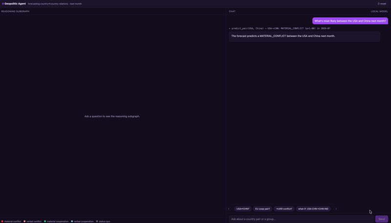
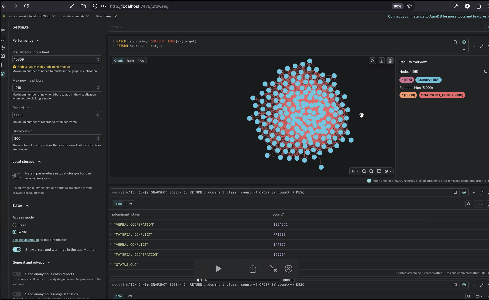
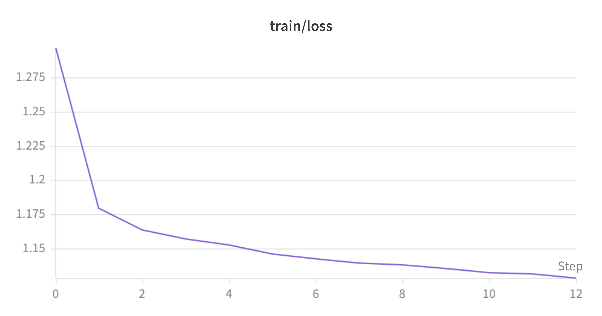
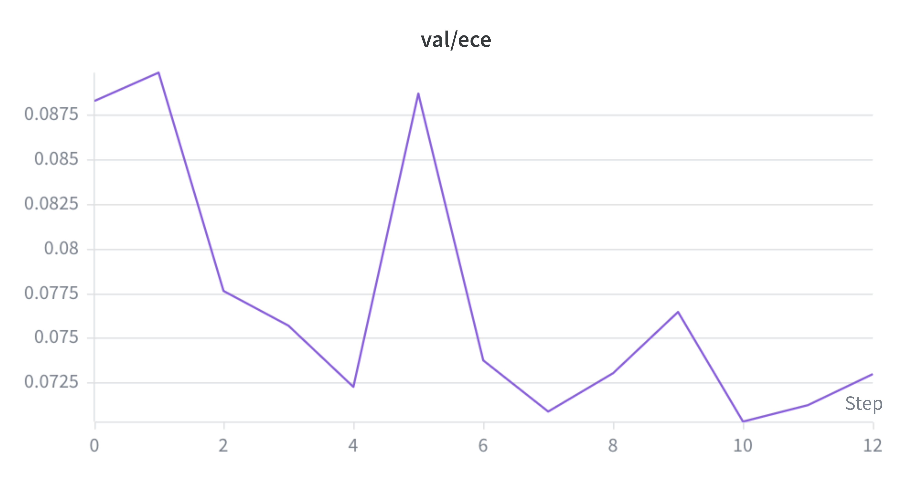

A geopolitical simulation powered by a Spatio-Temporal Graph Neural Network (GNN) that forecasts how pairs of countries will interact one month into the future. The model ingests a trailing 12-month window of directed country-to-country event graphs — built from GDELT, ACLED, World Bank, Wikidata, V-Dem, SIPRI, and UNDP data — and classifies each directed pair into one of five relationship categories: **material conflict** (military actions, cyberattacks, physical clashes), **verbal conflict** (threats, sanctions, severing of diplomatic relations), **material cooperation** (financial aid, arms transfers, joint military exercises), **verbal cooperation** (treaty signings, official state visits, public declarations of support), or **status quo** (no significant event or change). For every country pair the model outputs a calibrated probability distribution across all five classes, enabling both ranked forecasts and interpretable explanations via GNNExplainer subgraph attribution and Integrated Gradients feature attribution.

---

# Demo of Agent

# Databases view

- Raw database

- Aggregated database

# ML Workflow

## Training

The spatio-temporal GNN is trained on monthly country-pair snapshots from 2010 to 2026-06
(time\_step 0–197). Cross-entropy loss converges smoothly over 12 epochs from ~1.30 to ~1.11,
with no sign of overfitting.

Validation Expected Calibration Error (ECE) trends down from 0.088 to ~0.072.

## Test results — confusion matrix

Evaluated on the held-out test split across all five relationship classes. Diagonal = correct
predictions (bold).

| Actual \ Predicted | MATERIAL\_CONFLICT | VERBAL\_CONFLICT | MATERIAL\_COOPERATION | VERBAL\_COOPERATION | STATUS\_QUO |
|---|---:|---:|---:|---:|---:|
| MATERIAL\_CONFLICT | **29,556** | 4,450 | 3,151 | 6,459 | 683 |
| VERBAL\_CONFLICT | 844 | **3,027** | 2,103 | 2,340 | 792 |
| MATERIAL\_COOPERATION | 498 | 1,462 | **2,471** | 2,198 | 650 |
| VERBAL\_COOPERATION | 12,520 | 14,397 | 17,217 | **30,909** | 6,592 |
| STATUS\_QUO | 533 | 34,016 | 43,078 | 29,988 | **333,506** |

**Overall test accuracy: 68.5%** (399,469 / 583,440 predictions correct).
